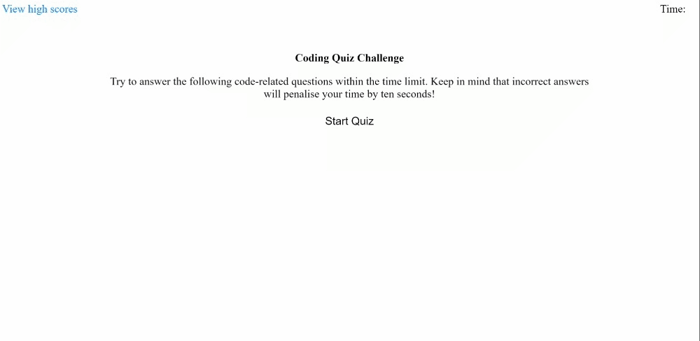

# Module-02-Challenge
Bootcamp Module 04 Challenge - Create a Quiz

This assignment code is to help student to find work by taking a timed quiz on JavaScript fundamentals that stores high scores SO THAT I can gauge my progress compared to my peers

**The acceptance criteria is as follow :**
- GIVEN I am taking a code quiz,
- WWHEN I click the start button THEN a timer starts
- I am presented with a question
- WHEN I answer a question
- THEN I am presented with another question
- WHEN I answer a question incorrectly
- THEN time is subtracted from the clock
- WHEN all questions are answered or the timer reaches 0
- THEN the game is over
- WHEN I click on the images of the applications
- THEN I am taken to that deployed application
- WHEN the game is over
- THEN I can save my initials and score

**Deployment:**
1. Website ; https://momentes.github.io/04-Quiz/

**Screenshot**
How my website looks like

Thank you
End.        

